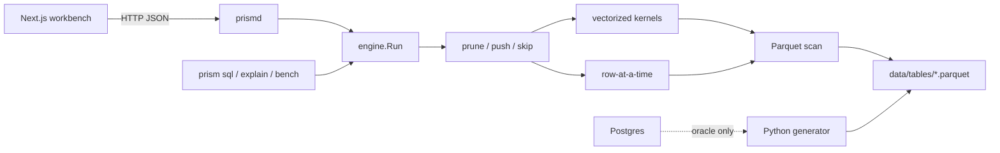
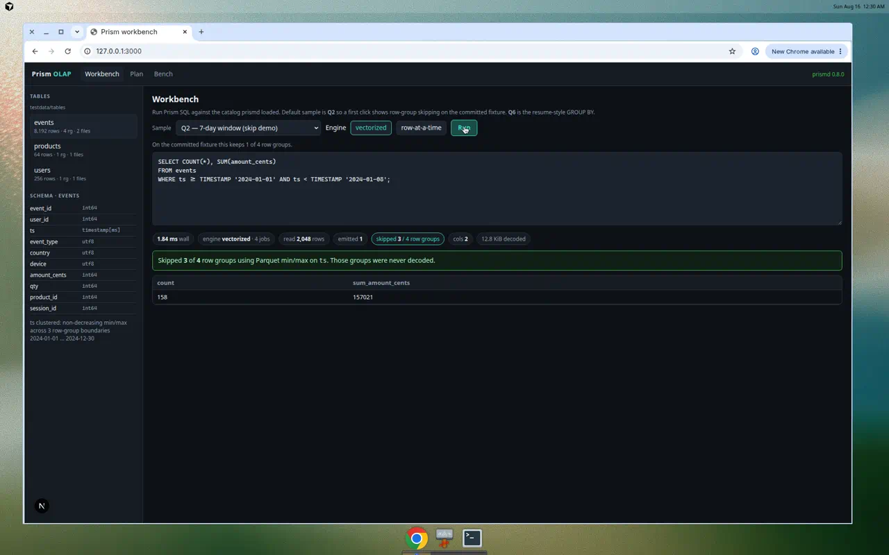

# Prism

A miniature **vectorized, single-node OLAP engine** for learning how analytical databases actually work: Parquet on disk, Apache Arrow in memory, predicate pushdown, column pruning, row-group skipping, and a batched execution pipeline.

**Windows is the supported local setup.** Follow **[docs/WINDOWS.md](docs/WINDOWS.md)** (native PowerShell + Docker Desktop; WSL is optional).

Blueprint: **[IMPLEMENTATION_PLAN.md](./IMPLEMENTATION_PLAN.md)** (decisions locked in §20).  
How a query runs: **[docs/architecture.md](docs/architecture.md)**.  
Interview script: **[WRITEUP.md](./WRITEUP.md)**.

## What’s here (v1 / Phase 0–14)

- Catalog + zone maps: `prism tables` / `prism describe`
- Vectorized scan, filter, hash agg, sort, limit over Arrow
- Hand-rolled SQL subset ([docs/sql.md](docs/sql.md))
- Dual engine (`--engine=vectorized|row`) and `--jobs` row-group workers
- Postgres oracle on `tiny`/`dev` (never laptop)
- `prism bench` + checked-in `bench/results/sample.json`
- `prismd` HTTP API ([docs/api.md](docs/api.md))
- Three-page Next.js workbench (`web/`)

```bash
go test ./...
go run ./cmd/prismd --listen 127.0.0.1:8080 --data-dir testdata/tables
# other terminal
cd web && npm install && NEXT_PUBLIC_API=http://127.0.0.1:8080 npm run dev
# open http://127.0.0.1:3000  — Run Q2, see 3 of 4 row groups skipped
```

On Windows PowerShell use `.\` paths and `.\scripts\windows\prism.ps1 engine` / `web`.

## Architecture



Details: [docs/architecture.md](docs/architecture.md).



## Resume line (placeholders)

> Engineered a vectorized, single-node OLAP engine in Go querying Parquet via Apache Arrow, with predicate pushdown, column pruning, and row-group skipping, sustaining 100M+ rows/query at 10x a row-at-a-time baseline

Those numbers are a **direction**. Measure `--scale laptop` on the Windows machine, name the query and the **row-naive** baseline, then replace. Do not copy testdata chart timings onto a resume. See [docs/benchmarks.md](docs/benchmarks.md).

## Stack (locked)

Go 1.22 · Apache Arrow Go **v18.0.0** · Apache Parquet · PostgreSQL (oracle only) · Python / NumPy / PyArrow · Next.js / TypeScript · Docker Desktop (Postgres)

No DuckDB, no joins in v1, no license file.

## Status

| Phase | Description | State |
|---|---|---|
| Plan | Blueprint + Windows runbook | Done |
| 0–9 | Scan through parallel dual engine | Done |
| 10 | Postgres oracle + generator | Done (laptop row count is a Windows-machine measurement) |
| 11 | Bench harness | Done (sample.json is testdata) |
| 12 | `prismd` HTTP API | Done |
| 13 | Next.js workbench | Done |
| 14 | Portfolio polish | Done (resume numbers still placeholders) |
